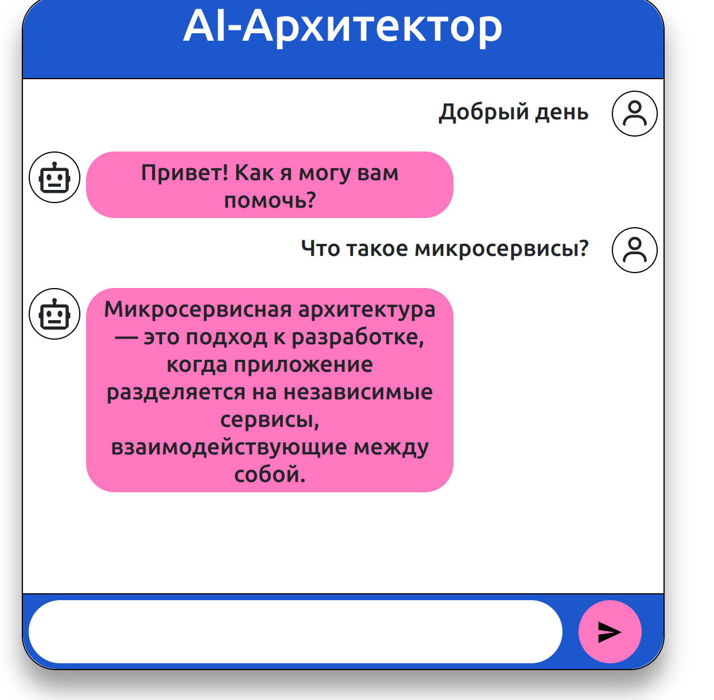

# AI-Архитектор
## Стек технологий
- npm: '8.5.1'
- node: '12.22.9'
- Python: 3.9.18
- pip: 24.2

## Запуск проекта
### Запуск web-приложения
```shell
npm install
npm run build
npm run start
```

### Запуск Rasa
```shell
pip install -r req.txt
cd rasa
rasa run --enable-api --cors "*" --debug
rasa run actions --debug
```

## Пример работы приложения


[Rasa debug logs](example/rasa.debug.log)

[Rasa-actions debug logs](example/rasa_actions.debug.log)


